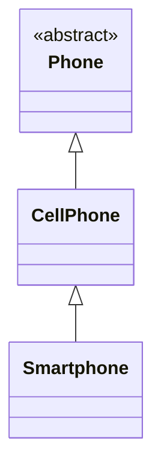

# Podsumowanie Szkolenia C# .NET

## Przegląd Projektów

Repozytorium zawiera kompleksowe przykłady i ćwiczenia z programowania w C# .NET, obejmujące podstawy języka, programowanie obiektowe oraz wzorce projektowe.

---

## 1. Podstawy C# (Basics)

### HelloWorldApp
Podstawowa aplikacja konsolowa demonstrująca strukturę projektu C# i podstawowe operacje wejścia/wyjścia.

### ConsoleApp
Rozszerzona aplikacja konsolowa pokazująca podstawowe konstrukcje języka C#.

---

## 2. Programowanie Obiektowe (OOP)

### ObjectsApp
Projekt demonstrujący podstawowe koncepcje programowania obiektowego:

- **Klasy i obiekty**: Przykłady tworzenia instancji klas
- **Dziedziczenie**: Hierarchia klas `Phone` → `CellPhone` → `Smartphone`
- **Klasy abstrakcyjne**: Klasa `Phone` jako klasa abstrakcyjna
- **Właściwości**: Gettery i settery, właściwości wymagane (`required`)
- **Konstruktory**: Konstruktory z parametrami i wartościami domyślnymi
- **Kompozycja**: Relacje między obiektami (np. `Battery`, `TouchScreen`)

---

## 3. Wzorce Projektowe (Design Patterns)

### 3.1. Wzorce Kreacyjne (Creational Patterns)

#### Singleton Pattern
**Cel**: Zapewnienie, że klasa ma tylko jedną instancję i zapewnienie globalnego punktu dostępu do niej.

**Implementacja**: 
- `MonitorState` - singleton przechowujący stan monitora (Enqueued, Processed, Sent)
- `Logger` - przykład singleton dla logowania

**Zastosowanie**: Gdy potrzebujemy jednej instancji obiektu współdzielonej w całej aplikacji (np. konfiguracja, logger, cache).

#### Builder Pattern
**Cel**: Konstruowanie złożonych obiektów krok po kroku.

**Implementacja**:
- `ReportBuilderFactory` - fabryka tworząca buildery raportów
- Różne formaty raportów (Text, HTML)
- Director pattern - sekwencja budowania (AddHeader → AddContent → AddFooter)

**Zastosowanie**: Gdy konstrukcja obiektu jest skomplikowana i wymaga wielu kroków.

---

### 3.2. Wzorce Strukturalne (Structural Patterns)

#### Adapter Pattern
**Cel**: Umożliwienie współpracy klas o niekompatybilnych interfejsach.

**Implementacja**:
- **Object Adapter**: `MotorolaRadioAdapter`, `HyteraRadioAdapter` - adaptują różne radia do wspólnego interfejsu `IRadio`
- **Class Adapter**: `MotorolaRadioClassAdapter` - przykład adaptera przez dziedziczenie
- **Legacy Printer**: Adapter dla starego systemu drukarek
- `RadioAdapterFactory` - fabryka tworząca odpowiednie adaptery

**Zastosowanie**: Integracja z zewnętrznymi bibliotekami, systemami legacy, różnymi API.

#### Composite Pattern
**Cel**: Komponowanie obiektów w struktury drzewiaste do reprezentowania hierarchii części-całość.

**Implementacja**:
- `CompositeValidator` - kompozyt walidatorów klientów
- `NipCustomerValidator`, `RegonCustomerValidator` - pojedyncze walidatory
- `ICustomerValidator` - wspólny interfejs dla pojedynczych i złożonych walidatorów
- `CustomerController` - używa kompozytu do walidacji

**Zastosowanie**: Walidacja, przetwarzanie hierarchiczne, struktury drzewiaste.

#### Decorator Pattern
**Cel**: Dynamiczne dodawanie nowych funkcjonalności do obiektów bez zmiany ich struktury.

**Implementacja**:
- **Product Decorator**: `DiscountProductDecorator` - dodaje rabaty do produktów
- **Salary Decorator**: System dekoratorów wynagrodzeń:
  - `BaseSalary` - podstawowe wynagrodzenie
  - `SenioritySalaryDecorator` - premia za staż
  - `TrainingSalaryDecorator` - premia za szkolenia
  - `MentorSalaryDecorator` - premia za mentoring
- `SalaryBuilder` - builder do konstruowania dekoratorów
- Architektura warstwowa: Domain, Application, Infrastructure

**Zastosowanie**: Rozszerzanie funkcjonalności bez modyfikacji istniejącego kodu, dodawanie funkcji w runtime.

#### Proxy Pattern
**Cel**: Kontrola dostępu do obiektu poprzez zastąpienie go obiektem pośredniczącym.

**Implementacja**:
- `CacheProductRepository` - proxy z cache'owaniem
- `DbProductRepository` - rzeczywista implementacja dostępu do bazy danych
- `ProductController` - używa proxy do optymalizacji dostępu do danych

**Zastosowanie**: Lazy loading, cache'owanie, kontrola dostępu, logowanie.

---

### 3.3. Wzorce Behawioralne (Behavioral Patterns)

#### Strategy Pattern
**Cel**: Definiowanie rodziny algorytmów, enkapsulacja ich i uczynienie wymiennymi.

**Implementacja**:
- `ProductCalculator` - kalkulator produktów z wymiennymi strategiami
- `DiscountPricingStrategy`, `OpenDoorPricingStrategy` - różne strategie wyceny
- Dynamiczna zmiana strategii w runtime

**Zastosowanie**: Gdy mamy wiele sposobów wykonania zadania i chcemy wybierać je w runtime.

#### Chain of Responsibility Pattern
**Cel**: Przekazywanie żądań wzdłuż łańcucha handlerów.

**Implementacja**:
- `IMessageHandler` - interfejs handlera
- `MessageHandler` - klasa bazowa z mechanizmem łańcucha
- Specjalizowane handlery:
  - `ExceptionMessageHandler` - obsługa wyjątków
  - `ValidateFromWhiteListMessageHandler` - walidacja białej listy
  - `ValidateADEMessageHandler` - walidacja ADE
  - `ValidateSubjectOrderNumberMessageHandler` - walidacja numeru zamówienia
  - `ValidateAndExtractNipMessageHandler` - walidacja i ekstrakcja NIP
- `MessageHandlerFactory` - tworzenie łańcucha handlerów
- `MessageProcessor` - procesor wykorzystujący łańcuch

**Zastosowanie**: Przetwarzanie żądań, walidacja, middleware, pipeline processing.

#### Template Method Pattern
**Cel**: Definiowanie szkieletu algorytmu w klasie bazowej, pozostawiając niektóre kroki do implementacji w klasach pochodnych.

**Implementacja**:
- `OrderCalculatorTemplate` - klasa abstrakcyjna z szablonem metody `CalculateDiscount`
- Konkretne implementacje:
  - `HappyHoursOrderCalculator` - rabat w godzinach szczytu
  - `SpecialDateOrderCalculator` - rabat w specjalne daty
  - `CouponOrderCalculatorTemplate` - rabat kuponowy
  - `PercentageOrderCalculatorTemplate` - rabat procentowy
- Metoda szablonowa definiuje strukturę, klasy pochodne implementują szczegóły

**Zastosowanie**: Gdy algorytm ma stałą strukturę, ale niektóre kroki mogą się różnić.

---

## 4. Zaawansowane Koncepcje C#

### CollectionConsoleApp
Demonstracja kolekcji w C#:
- Listy, słowniki, zbiory
- Operacje na kolekcjach
- Przykład z klasą `Customer`

### GenericClassConsoleApp
Programowanie generyczne:
- Klasy generyczne (`FakeEntityRepository<T>`)
- Repozytoria generyczne dla różnych encji (`Customer`, `Vehicle`)
- Elastyczność i reużywalność kodu

### GenericInterfaceConsoleApp
Interfejsy generyczne:
- Definiowanie kontraktów z typami generycznymi
- Przykłady użycia z klasą `Customer`

### LambdaExpressionConsoleApp
Wyrażenia lambda i LINQ:
- Składnia lambda
- Delegaty i funkcje anonimowe
- Przetwarzanie kolekcji

### ExtensionMethodConsoleApp
Metody rozszerzające:
- Rozszerzanie istniejących klas bez modyfikacji
- Przykłady użycia metod rozszerzających

### RepositoryPatternConsoleApp
Wzorzec Repository:
- Abstrakcja dostępu do danych
- Implementacje: `FakeCustomerRepository`, `DbCustomerRepository`, `CsvFileCustomerRepository`
- `ICustomerRepository` - interfejs repozytorium
- `CustomersController` - kontroler wykorzystujący repozytorium
- Separacja warstw i testowalność

### CurrencyCalculatorConsoleApp
Kalkulator walutowy:
- `IRateProvider` - interfejs dostawcy kursów
- `NbpCurrencyRateProvider` - dostawca kursów NBP
- `ForexCurrencyRateProvider` - dostawca kursów Forex
- `RateProviderFactory` - fabryka dostawców
- Wzorzec Strategy i Factory

### SeparationInterfacesConsoleApp
Separacja interfejsów (Interface Segregation Principle):
- `IBankomat` - przykład interfejsu segregowanego
- Zasada SOLID w praktyce

---

## Podsumowanie

Repozytorium prezentuje kompleksowe podejście do nauki C# .NET:

1. **Podstawy**: Od prostych aplikacji konsolowych po zaawansowane konstrukcje języka
2. **OOP**: Klasy, dziedziczenie, polimorfizm, enkapsulacja
3. **Wzorce Projektowe**: 
   - **2 wzorce kreacyjne**: Singleton, Builder
   - **4 wzorce strukturalne**: Adapter, Composite, Decorator, Proxy
   - **3 wzorce behawioralne**: Strategy, Chain of Responsibility, Template Method
4. **Zaawansowane tematy**: Generyki, LINQ, Repository Pattern, SOLID principles

Wszystkie przykłady są praktyczne i pokazują realne zastosowania wzorców projektowych w aplikacjach biznesowych.
