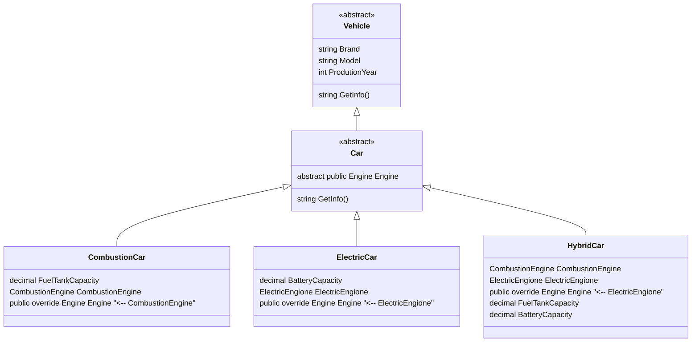
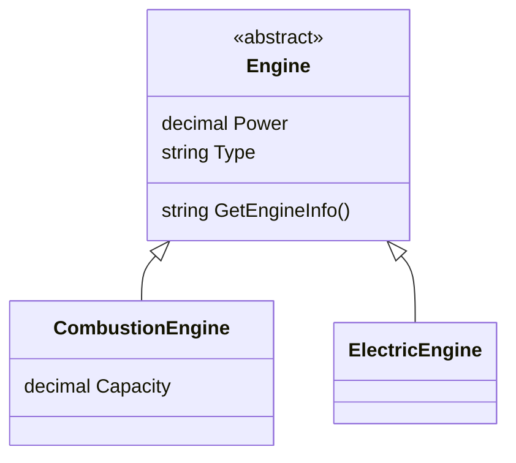

## Diagram klas

```mermaid 
classDiagram 
	
    class Vehicle {
        <<abstract>>

        string Brand
        string Model 
        int ProdutionYear

        string GetInfo()
    }

    class Car {
        <<abstract>>

         abstract public Engine Engine

        string GetInfo()
    }

    class CombustionCar {
        decimal FuelTankCapacity

        CombustionEngine CombustionEngine

        public override Engine Engine "<-- CombustionEngine"
    }
    
    class ElectricCar {
       decimal BatteryCapacity

       ElectricEngione ElectricEngione

       public override Engine Engine "<-- ElectricEngione"
    }
    
    class HybridCar {
        CombustionEngine CombustionEngine
        ElectricEngione ElectricEngione

       public override Engine Engine "<-- ElectricEngione"
        
        decimal FuelTankCapacity
        decimal BatteryCapacity
    }

    Vehicle <|-- Car
    Car <|-- CombustionCar
    Car <|-- ElectricCar
    Car <|-- HybridCar

    
```

```mermaid 
    classDiagram 

    class Engine {
        <<abstract>>

        decimal Power
        
        string Type
        string GetEngineInfo()
    }

    class CombustionEngine {
        decimal Capacity
    }

    class ElectricEngine {
    
    }

    Engine <|-- CombustionEngine
    Engine <|-- ElectricEngine


```